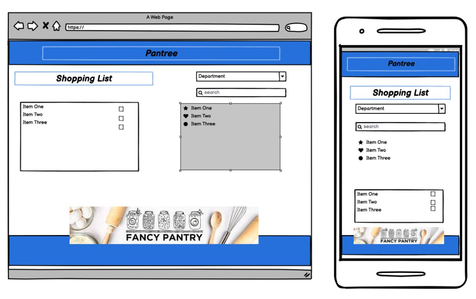

# FancyPantry

## Description

Often we see a individual at the grocery story walking around with their shopping list on a small paper and searching for pen’s to check off the items in their shopping cart, we are developing an app that will allow them to carry their shopping list with them with no need for paper and a pen. 

This app will allow the to easily take inventory of their home’s food supplies and the items that need to be add to the shopping list. Allowing them to then check off the item once it is in their cart or upon purchase.

## Table of Contents 

- [Prerequisites](#prerequisites)
- [Test](#test)
- [Usage/Installation ](#usage/installation)
- [Credits/Collaborators ](#credits/collaborators)
- [License](#license)

## Prerequisites: 

- bcrypt installation
- connect-session-sequelize
- dotenv
- express
- express-handlebars
- express-session
- mysql2
- sequelize

## Test
NOne

## Usage / Installation

1.  After cloning repo to your device in terminal run "npm install"
2.  Open up SQL Workbench and run the db files tech_blog.sql.
3.  In .envEXAMPLE file set up your connection (database, username, password).
4.  Rename .envEXAMPLE to ".env"
5.  Open terminal and locate the folder
6.  In terminal command line run "npm start"

GitHub Repo: https://github.com/codeSweats/FancyPantry

Video Walk Through: 

Heroku: 

Wireframe image: 

 

## Credits/Collaborators 

Sean Francis 
Rodrigo Galicia 
Ana Moreno 

## Licence

MIT License

Copyright (C) 2021, Ana Moreno

Permission is hereby granted, free of charge, to any person obtaining a copy
of this software and associated documentation files (the "Software"), to deal
in the Software without restriction, including without limitation the rights
to use, copy, modify, merge, publish, distribute, sublicense, and/or sell
copies of the Software, and to permit persons to whom the Software is
furnished to do so, subject to the following conditions:

The above copyright notice and this permission notice shall be included in all
copies or substantial portions of the Software.

THE SOFTWARE IS PROVIDED "AS IS", WITHOUT WARRANTY OF ANY KIND, EXPRESS OR
IMPLIED, INCLUDING BUT NOT LIMITED TO THE WARRANTIES OF MERCHANTABILITY,
FITNESS FOR A PARTICULAR PURPOSE AND NONINFRINGEMENT. IN NO EVENT SHALL THE
AUTHORS OR COPYRIGHT HOLDERS BE LIABLE FOR ANY CLAIM, DAMAGES OR OTHER
LIABILITY, WHETHER IN AN ACTION OF CONTRACT, TORT OR OTHERWISE, ARISING FROM,
OUT OF OR IN CONNECTION WITH THE SOFTWARE OR THE USE OR OTHER DEALINGS IN THE
SOFTWARE.
